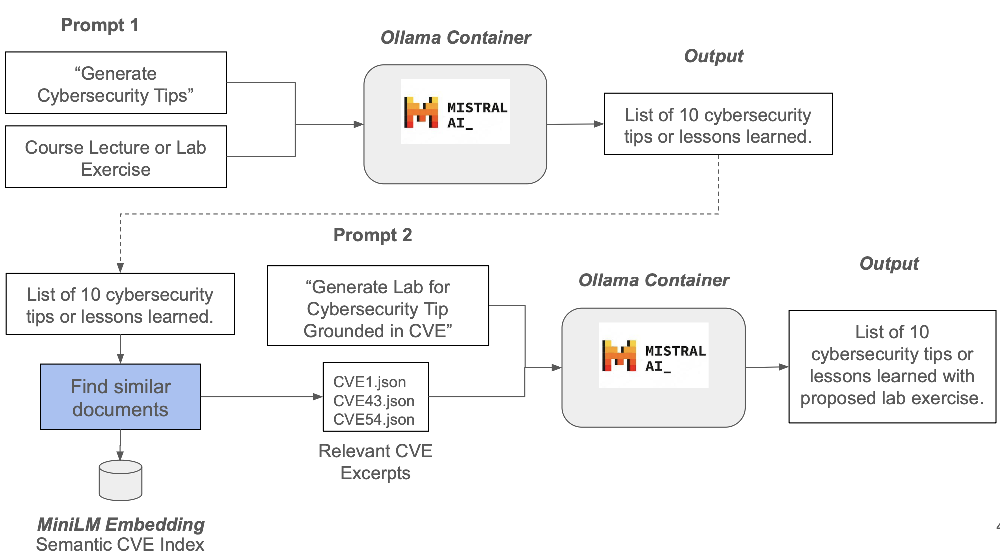

# 📑 CVE-Based Educational Labs

To bridge the gap between theory and practice in cybersecurity education, we are developing an AI-powered system that dynamically generates cybersecurity best practices and hands-on labs based on real-world vulnerabilities. This system leverages Retrieval-Augmented Generation (RAG) to enhance a Large Language Model (LLM) like Mistral or LLaMA, ensuring that lab exercises align with current threats, course content, and student experience levels

---

## 💪 Features

- 🧠 **Highlight generation** using Ollama + Mistral
- 🛡️ **CVE matching** using ChromaDB (MiniLM embeddings)
- 🧪 **Lab builder** that returns vulnerable code + Dockerfile
- 📎 Fully containerized with Docker Compose
- 📝 API-first with Flask server

---

## ✨ Getting Started

### 1️⃣ Clone the project

```bash
git clone https://github.com/your-username/rag-pipeline.git
cd rag-pipeline
```

### 2️⃣ Set up environment variables

```bash
cp .env.example .env
```

Then edit `.env` to customize:

```env
CHROMA_URL=http://chromadb:8000
CHROMA_DB_PORT=8000
CHROMA_DB_MINILM_COLLECTION_NAME=cves_minilm
CHROMA_DB_MINILM_MODEL_NAME=sentence-transformers/all-MiniLM-L6-v2
OLLAMA_HOST=http://ollama:11434
DEFAULT_OLLAMA_MODELS=mistral
```

---

## 🐳 Running the System

### 🔨 Build services

```bash
make build
```

### ▶️ Start services

```bash
make up
```

### 🧠 Pull models (optional)

```bash
make pull MODEL=mistral
```

You can also preload models automatically by setting in `.env`:

```env
DEFAULT_OLLAMA_MODELS=mistral llama2 llama3
```

---

## 🔌 API Endpoints

### 🔹 `POST /generate-lab`

Generates cybersecurity highlights from a lecture, finds a matching CVE, and produces a hands-on lab setup (code + Dockerfile).

#### 🔸 Request Body

```json
{
  "lecture_id": 101,
  "lecture_name": "Introduction to Cybersecurity",
  "lecture_content": "This lecture covers cybersecurity basics...",
  "use_existing_highlights": true
}
```

| Field                   | Description                                                                 |
|-------------------------|-----------------------------------------------------------------------------|
| `lecture_id`            | Unique ID of the lecture                                                    |
| `lecture_name`          | Name of the lecture (used for caching files)                                |
| `lecture_content`       | Full raw content of the lecture to analyze                                  |
| `use_existing_highlights` | If `true`, the API will reuse cached highlights and labs if they exist     |

> 🧠 If `use_existing_highlights` is `true`, the API checks for these files:
> - `highlights/<lecture_name>_highlights.json`
> - `lecture_outputs/<lecture_name>_labs.json`
>
> If found, it **skips Ollama generation and Chroma queries**, returning the cached lab result instantly.

#### 🔸 Example curl

```bash
curl -X POST http://localhost:5000/generate-lab   -H "Content-Type: application/json"   -d '{
    "lecture_id": 101,
    "lecture_name": "Introduction to Cybersecurity",
    "lecture_content": "This lecture covers cybersecurity basics...",
    "use_existing_highlights": true
}'
```

### 🔹 `POST /test-ollama`

Basic endpoint to test connection to the Ollama server.

#### 🔸 Request Body

```json
{ "text": "What is SQL injection?" }
```

#### 🔸 curl

```bash
curl -X POST http://localhost:5000/test-ollama   -H "Content-Type: application/json"   -d '{"text": "What is SQL injection?"}'
```

---

## 📊 System Architecture

The following diagram shows the full pipeline for transforming lecture content into hands-on cybersecurity labs using Ollama and ChromaDB:



### 📊 Process Overview

1. **Prompt 1:**  
   Ollama (Mistral model) generates cybersecurity highlights from lecture content.

2. **CVE Matching:**  
   Each highlight is matched against a MiniLM-based semantic index of CVEs using ChromaDB.

3. **Prompt 2:**  
   Ollama uses the matched CVE data + highlight to generate a hands-on lab experience.

4. **Output:**  
   A JSON response with CVE metadata, highlights, and lab setup (code + Dockerfile).

> Cached results (highlights and labs) are saved locally and reused when `use_existing_highlights: true` is provided.

---

## 📂 Folder Structure

| Folder              | Purpose                                  |
|---------------------|------------------------------------------|
| `chroma_data/`      | Persisted ChromaDB storage               |
| `cyberlab-api/`     | Flask API service for highlight + lab gen |
| `chroma-indexer/`   | Indexing pipeline for CVEs into ChromaDB |
| `highlights/`       | Raw highlights per lecture               |
| `lecture_outputs/`  | Final enriched highlights + labs         |

---

## 🧪 Example Output

```json
[
  {
    "title": "OAuth2 Token Leakage",
    "related_slides": ["Authorization Flows"],
    "discussion": "...",
    "lab_opportunity": "...",
    "cve_match": {
      "metadata": { "cve_id": "CVE-2025-0001", ... },
      "page_content": "Description: ..."
    },
    "lab_experience": {
      "vulnerable_code": "...",
      "fixed_version": "...",
      "docker_file": "..."
    }
  }
]
```

---

## 🧹 Useful Commands

```bash
make logs            # View logs from cyberlab-api
make restart         # Restart all services
make down            # Stop everything
```

---

## 👨‍💼 Author

**CyberLab Team** – 2025  
Questions? Open an issue or ping the team.
